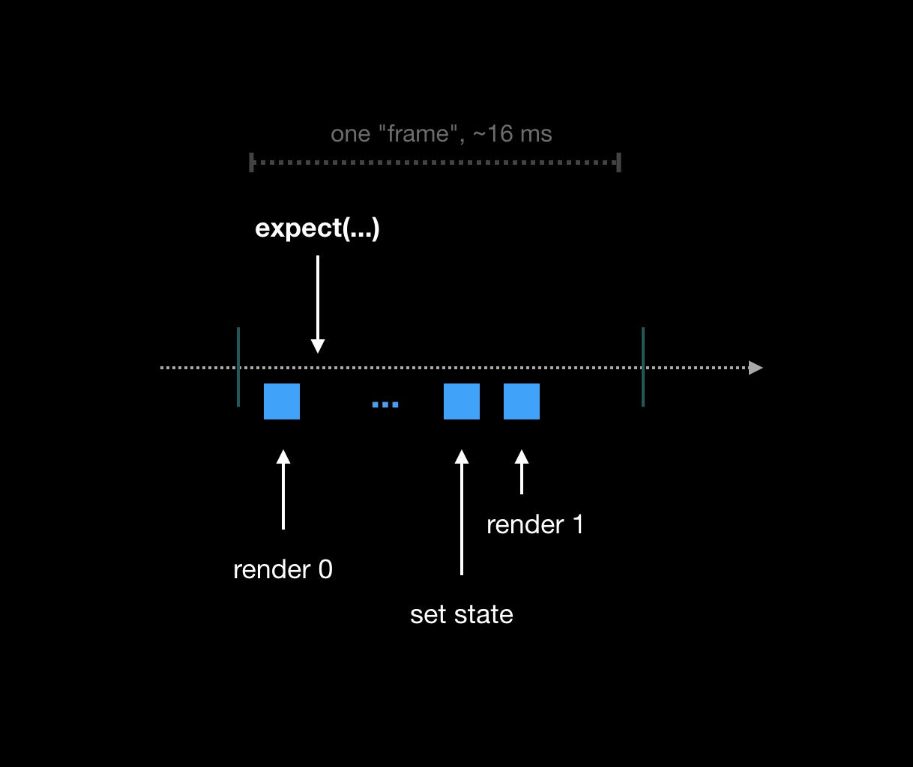

# React 测试用例

## 一、常见的测试框架

- Jest
- Enzyme
- Mocha全家桶（套餐内容大概率是：Mocha + Chai + Sinon + Istanbul）
- react-test-renderer
- react-dom/test-utils

### [Jest](https://jestjs.io/)

Jest 是 Facebook 开发的一款 JavaScript 测试框架。在 Facebook 内部广泛用来测试各种 JavaScript 代码。其官网上主要列出了以下几个特点：

- 轻松上手
  - 使用 create-react-app 或是 react-native init 创建的项目已经默认集成了 Jest
  - 现有项目，只需创建一个名为 __test__ 的目录，然后在该目录中创建以 .spec.js 或 .test.js 结尾的文件即可
- 内置强大的断言与 mock 功能
- 内置测试覆盖率统计功能
- 内置 Snapshot 机制

虽然 Jest 官网介绍中多次 React，但实际上 Jest 并不是和 React 绑定的。你可以使用它测试任何 JavaScript 项目。

### [Enzyme](https://airbnb.io/enzyme/)

由 Airbnb 出品。官方文档中给自己的定义是：

> Enzyme is a JavaScript Testing utility for React that makes it easier to assert, manipulate, and traverse your React Components’ output.

从这里可以看出两点信息：

- Enzyme 的定位是一个工具库
- Enzyme 的出现是为了让我们更方便的遍历、操作 React 组件输出的内容

### [Mocha](https://mochajs.org/)

Mocha 是另一个 JavaScript 测试框架。与 Jest 不同的是，它自身只提供作为一个测试框架最核心的功能。而其它增强功能，如丰富的断言语法、mock、测试覆盖率统计等功能则是通过各种 Add-ons 提供的。与各种 Add-ons 搭配在一起形成了各种各样的“套餐”。而最常见的组合应该就是如下这样的搭配：

- [Chai](https://www.chaijs.com/) 负责断言
- [Sinon.js](https://sinonjs.org/) 负责 mock
- [Istanbul](https://github.com/gotwarlost/istanbul) 负责统计测试覆盖率

### [react-test-renderer](https://reactjs.org/docs/test-renderer.html)

在说 react-test-renderer 之前，让我们先聊聊什么是 renderer。React 最早是被用来开发网页的，所以早期的 React 库中还包含了大量和 DOM 相关的逻辑。后来 React 的设计思想慢慢被迁移到其它场景，最被人们熟知的莫过于 React Native 了。为了灵活性和扩展性，React 的代码被分拆为 React 核心代码与各种 renderer。React 自带了 3 个 renderer，前两个是大家常见的：

- [react-dom](https://github.com/facebook/react/tree/master/packages/react-dom) 负责将组建渲染到浏览器页面中。
- [react-native-renderer](https://github.com/facebook/react/tree/master/packages/react-native-renderer) 负责将组件渲染成原生场景中的各种 “View”。

### [react-dom/test-utils](https://reactjs.org/docs/test-utils.html)

首先从名称可以看出这个库是包含在 react-dom 中的。所以它只是 react-dom 的辅助测试工具。在 React 文档站中它的介绍页上用的标题却只有 “Test Utilities” 两个单词，很容易让人产生误解。该库中的方法主要作用是帮我们遍历 ReactDOM 生成的 DOM 树，方便我们编写断言。注意：使用该库时必须提供一个 DOM 环境。当然这个 DOM 环境可以是 jsdom 这种模拟环境。(友情提示：Jest 默认的执行环境就是 jsdom)

`react-test-renderer` 和 `react-dom/test-utils` 两者看起来还是很相似。何时该选择哪一个库呢？

- 如果需要测试事件（如 click, change, blur 等），那么使用 react-dom/test-utils
- 其它时候使用更简单、灵活的 react-test-renderer

## 二、测试React组件之 render(), act() 方法

### render

该方法负责把ReactElement渲染到container中去，是单元测试中主要的渲染方法，要注意的是其内部会自动调用act方法保证副作用函数被执行，使用方式如下：

``` javascript
function render(
  ui: React.ReactElement,
  options?: {
    // 这里的参数看官网
  }
): RenderResult

// in test case

const el = render(<HelloWorld />);

const { container, getByText } = el;

```

### act

内部大致执行过程是: act(callback)会把 callback 丢给 batchedUpdates 处理，而 batchedUpdates 会合并多个 update，之后再调用 flushWork ，它的作用就是 flush effects；如果callback是异步函数或者是一个返回Promise的函数，则会调用flushWorkAndMicroTasks，它会flush effects，同时还会等待微队列执行完毕，因为异步函数await左边部分或者Promise回调函数都是加入微队列执行的。

### act 例子1

让我们从一个简单的组件开始。

``` javascript
function App() {
  let [ctr, setCtr] = useState(0);
  useEffect(() => {
    setCtr(1);
  }, []);
  return ctr;
}

ReactDOM.render(<App />, document.getElementById("app"));
```

``` javascript
it("should render 1", () => {
  const el = document.createElement("div");
  ReactDOM.render(<App />, el);
  expect(el.innerHTML).toBe("1"); // fails!
});
```


> React 用 fiber 重写，当渲染时，React都不会“同步”呈现整个UI。它将工作分为几大块，并在调度程序中排队，所以这里并不会立刻执行 useEffect 里的代码。

在上面的组件中，正常的流程应该是：

- 第一次渲染输出 0
- 执行 effect 并将状态设置为 1
- 渲染并输出的位 1



我们在React尚未完成UI更新的某个时间点运行测试 会导致与期望不符, 

- 通过使用 `useLayoutEffect` 而不是 `useEffect` : 虽然这可以通过测试，但我们不能为了测试用例而限制代码的写法。
- 通过等待一些时间（例如100毫秒左右）：很糟糕的方式。

在16.8.0中，我们引入了新的测试api act(...)。对于在其范围内运行的任何代码，它保证两件事：

- 任何状态更新将被执行
- 任何排队的效果将被执行

``` javascript
it("should render 1", () => {
  const el = document.createElement("div");
  act(() => {
    ReactDOM.render(<App />, el);
  });
  expect(el.innerHTML).toBe("1"); // this passes!
});
```


### act 例子2

``` javascript
function App() {
  let [counter, setCounter] = useState(0);
  return <button onClick={() => setCounter(counter + 1)}>{counter}</button>;
}
```

``` javascript
it("should increment a counter", () => {
  const el = document.createElement("div");
  document.body.appendChild(el);
  // we attach the element to document.body to ensure events work
  ReactDOM.render(<App />, el);
  const button = el.childNodes[0];
  for (let i = 0; i < 3; i++) {
    button.dispatchEvent(new MouseEvent("click", { bubbles: true }));
  }
  expect(button.innerHTML).toBe("3");
});
```

``` javascript
act(() => {
  for (let i = 0; i < 3; i++) {
    button.dispatchEvent(new MouseEvent("click", { bubbles: true }));
  }
});
expect(button.innerHTML).toBe(3);
```

上面两种测试用例的写法都会通过吗？
---
---
---
---
---
---
---
---
---
---
---
---
---
---
---
---
---
---
---
---
---
---
---
---
---
---
---
---

act 的例子是 失败的。具体原因是:
> 如果处理程序彼此之间的调用接近，则 act 处理程序可能会使用陈旧数据并错过一些增量

解决方案：

- `setCounter(x => x + 1)` 这么书写的话代码应该会更加正确

- 写三个 act();
``` javascript 
act(() => {
  button.dispatchEvent(new MouseEvent("click", { bubbles: true }));
});
act(() => {
  button.dispatchEvent(new MouseEvent("click", { bubbles: true }));
});
act(() => {
  button.dispatchEvent(new MouseEvent("click", { bubbles: true }));
});
```

### act 例子3 (计时器)

``` javascript
function App() {
  const [ctr, setCtr] = useState(0);
  useEffect(() => {
    setTimeout(() => setCtr(1), 1000);
  }, []);
  return ctr;
}
```

``` javascript
// fail
it("should tick to a new value", () => {
  const el = document.createElement("div");
  act(() => {
    ReactDOM.render(<App />, el);
  });
  expect(el.innerHTML).toBe("0");
  // ???
  expect(el.innerHTML).toBe("1");
});
```

#### 方法一：

``` javascript
// warning
it("should tick to a new value", () => {
  jest.useFakeTimers();
  const el = document.createElement("div");
  act(() => {
    ReactDOM.render(<App />, el);
  });
  expect(el.innerHTML).toBe("0");
  jest.runAllTimers();
  expect(el.innerHTML).toBe("1");
});
```


当我们运行时runAllTimers()，组件中的超时问题解决了，触发了setState。但是还是会收到警告，提示我们需要 使用 act 将可能存在的异步操作包裹起来

``` javascript
// pass
it("should tick to a new value", () => {
  jest.useFakeTimers();
  const el = document.createElement("div");
  act(() => {
    ReactDOM.render(<App />, el);
  });
  expect(el.innerHTML).toBe("0");
  act(() => {
    jest.runAllTimers();
  });
  expect(el.innerHTML).toBe("1");
});
```

#### 方法二：

``` javascript
it("should tick to a new value", async () => {
  // a helper to use promises with timeouts
  function sleep(period) {
    return new Promise(resolve => setTimeout(resolve, period));
  }
  const el = document.createElement("div");
  act(() => {
    ReactDOM.render(<App />, el);
  });
  expect(el.innerHTML).toBe("0");
  await act(async () => {
    // wait *just* a little longer than the timeout in the component
    await sleep(1100); 
  });
  expect(el.innerHTML).toBe("1");
});
```

### act 例子4 (Promise)

``` javascript
function App() {
  let [data, setData] = useState(null);
  useEffect(() => {
    fetch("/some/url").then(setData);
  }, []);
  return data;
}
```

``` javascript
it("should display fetched data", () => {
  let resolve;
  function fetch() {
    return new Promise(_resolve => {
      resolve = _resolve;
    });
  }

  const el = document.createElement("div");
  act(() => {
    ReactDOM.render(<App />, el);
  });
  expect(el.innerHTML).toBe("");
  resolve(42);
  expect(el.innerHTML).toBe("42");
});
```

测试用例可以通过，但是还是会收到一个 warning 提示。Fix it

``` javascript
// ...
expect(el.innerHTML).toBe("");
await act(async () => {
  resolve(42);
});
expect(el.innerHTML).toBe("42");
// ...
```

### act 例子5 (async / await)

``` javascript
function App() {
  let [data, setData] = useState(null);
  async function somethingAsync() {
    let response = await fetch("/some/url");
    setData(response);
  }
  useEffect(() => {
    somethingAsync();
  }, []);
  return data;
}
```

``` javascript
it("should display fetched data", async () => {
  let resolve;
  function fetch() {
    return new Promise(_resolve => {
      resolve = _resolve;
    });
  }
  const el = document.createElement("div");
  act(() => {
    ReactDOM.render(<App />, el);
  });
  expect(el.innerHTML).toBe("");
  await act(async () => {
    resolve(42);
  });
  expect(el.innerHTML).toBe("42");
});
```

## 三、我推荐 [testing-library](https://testing-library.com/docs/react-testing-library/intro)

## 四、踩过的坑
